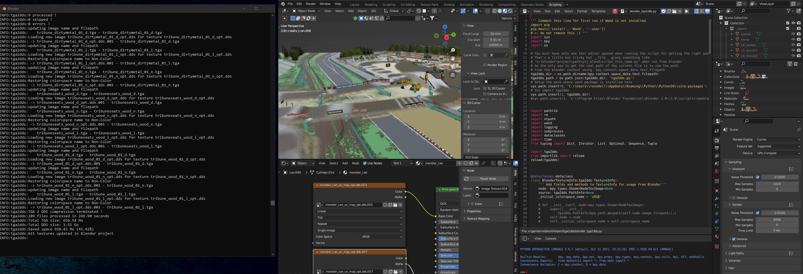

# tga2dds

Converter based on [Wand](https://docs.wand-py.org/en/0.6.10/) for automating image conversion. This converter has been written because the need of converting a lot of TGA images to DDS for optimization of 3d assets. That's why it is named `tga2dds` but it can be used for converting all types of images supported by Wand by specifying files extension in the options.

This module has been done during the creation of a track for the motocross simulator [MxBikes](https://store.steampowered.com/app/655500/MX_Bikes/). So there are also some specific features related to this context.

`tga2dds` can be used as a python module or called using the CLI interface.

## Usage python

Basic example

```python
import tga2dds
converter = tga2dds.Converter(args=tga2dds.Args(('C:/path/to/my/images'),))
res:tga2dds.Results = converter.convert()

```

The class `tga2dds.Args` stores the options to be passed to `tga2dds.Converter`. Here is a detailed description for all arguments:

```python
Args(
    ''' List of directories to process'''
    paths:List[str]
    '''Alpha mode. Determine the type of compression used depending of the presence of the alpha-channel in the image to be converted. Can be "on", "off" or "auto". Compression type is defined by the tuple of compression argument where first element of the tuple is used when no alpha channel is detected, and second is used in the other case.
    on: Compression for image with alpha channel is always applied
    off: Compression for image without alpha channel is always applied. The alpha-channel is also disabled in the converted image
    auto: Compression is applied according to alpha-channel presence in the source image'''
    alpha:str = alpha
    '''Type of compression to be used for conversion. Must correspond to type available according to the format of the image. default value is ('dxt1', 'dxt3') which are valid compression types of default output image format DDS'''
    compression:Tuple[str, str] = compression
    ''' lazy mode - does not create, or update, output image if it already exists can be useful if you run a second time after having added new images'''
    lazy:bool
    ''' Replace <file_name>.tga by <output_file_name>.dds in corresponding shd file, if found. Create automatically a new shd file in case output filename is different than the source one'''
    shd:bool
    ''' Replace <file_name>.tga by <output_file_name>.dds in given trk (Resolute Track Builder Helper project) file. Must exists'''
    trk:str
    ''' Suffix to be added to image output file name'''
    suffix:str
    ''' Process only files matching given patterns. Can be combined with exclude option. Used as regular expression'''
    filters:Sequence[str]
    ''' Process only files which are not matching given patterns. Can be combined with filter option. Used as regular expression.'''
    excludes:Sequence[str]
    ''' Extension for source file. "tga" by default, but can be any other format supported by Wand. Can be specified multiple times '''
    ext_src = ext_src
    ''' Extension for output file. "dds" by default, but can be any other format supported by Wand '''
    ext_out = ext_out
    ''' Enable verbose mode'''
    verbose:bool
)
```

The method `convert()` return an object of type `tga2dds.Results` which provides some useful informations about the files which has been processed, or not in case of skip (lazy mode) or errors.

```python
class Results:
    ''' Total size of source files'''
    total_source_size:int
    ''' Total size of output files'''
    total_out_size:int
    ''' List of all texture files processed as TextureInfo object'''
    processed:List[tga2dds.TextureInfo]
    ''' List of all texture files skipped, in lazy mode only, as TextureInfo object'''
    skipped:List[tga2dds.TextureInfo]
    ''' List of all texture files where conversion failed '''
    with_errors:List[tga2dds.TextureInfo]
    ''' The space saved by conversion. Difference between size of source and output files'''
    saved:int
    ''' Human readable string of saved space with relative percentage
    example: "348.43 Mo (43.50%)"'''
    saved_string:str
    ''' Number of files processed'''
    nb_processed:int
    ''' Number of files skipped'''
    nb_skipped:int
    ''' Number of files where conversion failes'''
    nb_errors:int
    ''' Human readable string of totale source size. like "13.4 Mo" '''
    total_source_size_string:str
    ''' Human readable string of totale output size. like "675.2 Ko" '''
    total_out_size_string:str
```

## Usage CLI

```bash
python tga2dds.py --filter 'normal.tga' --ext-src '.tga' --ext-out '.dds' c:\folder\containing\textures
```

Here is the help description of the arguments:
```
python tga2dds.py --help
usage: tga2dds.py [-h] [-a [{on,off,auto}]] [-c COMPRESSION] [-l] [--shd] [--trk [TRK]] [-s [SUFFIX]] [-f FILTER] [-e EXCLUDE] [--ext-src EXT_SRC] [--ext-out [EXT_OUT]] [-v] path [path ...]

Convert TGA images to DDS

positional arguments:
  path
    Path of folder(s) containing image files to convert

optional arguments:
  -h, --help            show this help message and exit
  -a [{on,off,auto}], --alpha [{on,off,auto}]
    On -> dxt3, off -> dxt1, auto -> enable alpha mode if alpha-channel is found in image, disable otherwise

  -c COMPRESSION, --compression COMPRESSION
    Type of compression to be used for non-alpha and alpha mode, provided as two values in the same order. Default are dxt1 (Non-alpha) and dxt3 (Alpha). Example: -c 'dxt1 dxt3'

  -l, --lazy
    Lazy mode, does not create output file if it already exists

  --shd
    Replace <file_name>.tga by <output_file_name>.dds in corresponding shd file, if found. Create automatically a new shdfile in case output filename is different than the source one. Option related to MxBikes

  --trk [TRK]
    Replace <file_name>.tga by <output_file_name>.dds in given trk (Resolute Track Builder Helper project) file. Must exists. Option related to MxBikes

  -s [SUFFIX], --suffix [SUFFIX]
    Suffix to be added to image output file name
  -f FILTER, --filter FILTER
    Process only files matching given patterns. Can be combined with exclude option. Used as regular expression

  -e EXCLUDE, --exclude EXCLUDE
    Process only files which are not matching given patterns. Can be combined with filter option. Used as regular expression.

  --ext-src EXT_SRC, --extension-source EXT_SRC
    Extension for source file. "tga" by default, but can be any other format supported by Wand. Can be specified multiple times

  --ext-out [EXT_OUT], --extension-output [EXT_OUT]
    Extension for output file. "dds" by default, but can be any other format supported by Wand

  -v, --verbose
    Enable verbose mode
```

## Replacing textures from Blender

Before to use it in a Blender project, make sure to use a copy of your original project in case something goes wrong or the result is not the one you have expected. You are responsible of any damage that you can cause to your projects using this code.

The script `blender_tga2dds.py` can be run from Blender for converting all the images of a project but also replace the images in the materials for pointing on the new files created. The colorspace property (sRGB, Non-Color, ...) is restored to the new converted image and the *shd* option is also enabled for updating or generating the shader files (related to MxBikes) when necessary

### Wand
For being able to convert the images, Wand package must be installed in the Blender python's environment and the path of the environment should be added to the python's system path
using `sys.path.insert(0, 'path/to/python/env/where/Wand/is/installed')`. More informations can be found by googling something like **How to install python modules in blender**.

Once Wand is installed:
- Open the Blender's project containing the textures to convert
- Go in the *Scripting* workspace, open `blender_tga2dds.py` from the code editorw
- Show the console window using menu *Window->Toggle System Console* if you want to see the information or error messages during the execution. Note that you can still display the console later.

Once this is done, run the script for starting the conversion of your textures using the run button or from menu *Text->Run Script*.
Note the process will probably take several seconds or even minutes depending of the number and size of the images converted. Using the system console is a good way to monitor the process and know when it's terminated.



## Log

Every time a conversion is done with `tga2dds`, a log file is created in a `log` folder, in the current working directory. Message are also printed in the console on channel `sys.stdout` during the execution.

Here is a typical log example of converting one folder containing two images:
```
INFO:tga2dds:Start compressing files.
INFO:tga2dds: Alpha mode auto
INFO:tga2dds:Processing folder C:\path\to\textures
INFO:tga2dds:opening image C:\path\to\textures\image1.tga
INFO:tga2dds:Processing image1.tga...
INFO:tga2dds:  Compressed successfully to:
INFO:tga2dds:    -> image1_opt.dds (dxt1)
INFO:tga2dds:  Checking file names in shader files...
INFO:tga2dds:    -> OK
INFO:tga2dds:
INFO:tga2dds:opening image C:\path\to\textures\image2.tga
INFO:tga2dds:Processing image2.tga...
INFO:tga2dds:  Compressed successfully to:
INFO:tga2dds:    -> image2_opt.dds (dxt3)
INFO:tga2dds:  Checking file names in shader files...
INFO:tga2dds:    -> OK
INFO:tga2dds:
INFO:tga2dds:TGA 2 DDS compression terminated !
INFO:tga2dds:2 files processed in 0.74 seconds
INFO:tga2dds:Total TGA size: 2.67 Mo
INFO:tga2dds:Total DDS size: 3.34 Mo
INFO:tga2dds:Saved space 693.49 Ko (79.75%)
INFO:tga2dds:
INFO:tga2dds:2 processed !
INFO:tga2dds:0 skipped !
INFO:tga2dds:0 errors !
```

Additional messages are added when `blender_tga2dds.py` is run from Blender

At start, listing images of the project
```
INFO:tga2dds:Image found image1.tga.004 - file:image1.tga
INFO:tga2dds:C:\path\to\textures\image1.tga
INFO:tga2dds:Image found image2.tga.004 - file:image2.tga
INFO:tga2dds:C:\path\to\textures\image2.tga
...
INFO:tga2dds:Processing 615 textures...
```

After each folder conversion, name and filepath of Blender's `Image` objects are updated.
```
...
INFO:tga2dds:updating image name and filepath
INFO:tga2dds:    image1.tga.004 - image1.tga
INFO:tga2dds:Loading new image image1_opt.dds for texture image1_opt.dds.004
INFO:tga2dds: -> image1_opt.dds - image1_opt.dds
INFO:tga2dds:updating image name and filepath
INFO:tga2dds:    image2.tga.004 - image2.tga
INFO:tga2dds:Loading new image image2_opt.dds for texture image2_opt.dds.004
INFO:tga2dds:Restoring colorspace name to Non-Color
INFO:tga2dds: -> image2_opt.dds - image2_opt.dds
...
```

At end
```
INFO:tga2dds:TGA 2 DDS compression terminated !
INFO:tga2dds:289 files processed in 249.90 seconds
INFO:tga2dds:Total TGA size: 1.55 Go
INFO:tga2dds:Total DDS size: 656.54 Mo
INFO:tga2dds:Saved space 928.43 Mo (41.42%)
INFO:tga2dds:615 textures updated in Blender project
```
